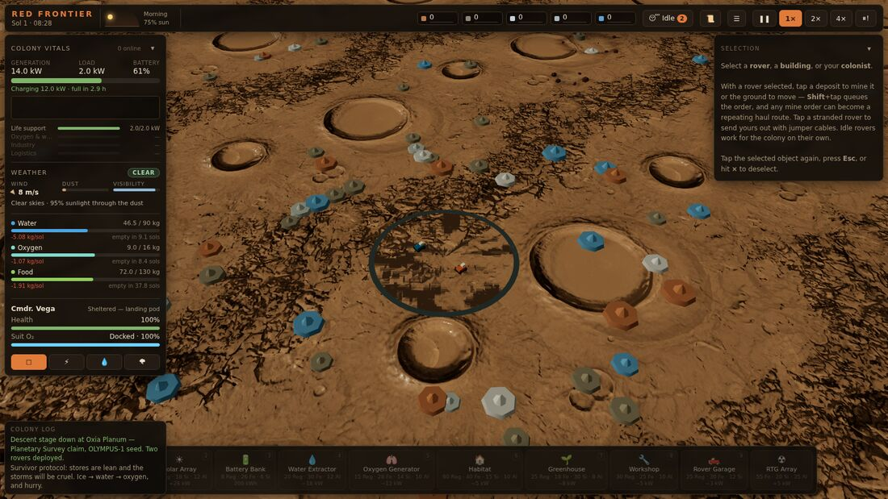

# Red Frontier

> *One human. A handful of machines. An entire planet that does not want you there.*
> Mars · 2066 — Real-Time Strategy · Survival · Automation · Exploration

A browser-first Mars survival RTS. Everything runs in a modern web browser: a
deterministic simulation on a module worker, a three.js WebGL2 renderer, a DOM
HUD, and a procedural Web Audio soundscape. No install, no account, no server —
a colony lives in `localStorage`.

## Pick a door

| If you want to… | Start with |
|---|---|
| **Play it** | [Getting Started](Getting-Started.md) → [How to Play](How-to-Play.md) |
| **Learn the systems** | [Architecture Overview](Architecture-Overview.md) → [Simulation Systems](Simulation-Systems.md) |
| **Contribute** | [Contributing](Contributing.md) → [Testing and QA](Testing-and-QA.md) |

## What is actually in the build

The repository is at **Prototype 4 plus the first exploration slice**, with four
shipped slices of the industrial pillar. In play today:

- **Terrain, camera, the Mars sol** — seeded local window on a compact Mars
  globe, orbit rig, a 24 h 39 m sol compressed into 4 minutes at 1×.
- **Survival chain** — ice → Water Extractor → water → Oxygen Generator → O₂ →
  Greenhouse → food, keeping one colonist alive, with suit-oxygen EVAs that the
  sim refuses when they would be fatal.
- **Power grid** — a pure resolver with four priority tiers; a brownout reads as
  *"Industry at 62%"*, never as an arbitrary subset going dark.
- **Weather as a field** — travelling storm systems with local intensity, dust
  that buries arrays, lightning in dust thick enough to electrify, a forecast
  that a Weather Radar Station extends.
- **Rover logistics** — queueable task orders, repeating haul routes, per-rover
  automation rules, seam reservations, a garage that fast-charges, services and
  assembles, wear and jump-start recovery, hull-clearance crawling.
- **Industry** — Refinery (iron ore → steel), Workshop (six selectable lines,
  counted component rack), rover part wear with a Repair Bay, commissioned
  water pipe networks.
- **Exploration** — seeded points of interest the map does not show until a
  rover finds them, a SALVAGE task, and Earth cargo missions on a burial clock
  that storms run faster.
- **Presentation** — minimap and zoomable world map with storm tracks, draggable
  snapping HUD panels, a pause menu with live settings, a 9 000-mote particle
  system, and a synthesised soundscape with no audio files.

Not in yet: research, multi-colonist population, atmosphere/heat/data networks,
building-level component wear, victory conditions. See
[Roadmap and Status](Roadmap-and-Status.md).

## Pages in this wiki

**Playing** — [Getting Started](Getting-Started.md) ·
[How to Play](How-to-Play.md) · [Interface and Controls](Interface-and-Controls.md) ·
[Blueprint Reference](Blueprint-Reference.md)

**Systems** — [Simulation Systems](Simulation-Systems.md) ·
[Power and Life Support](Power-and-Life-Support.md) ·
[Weather and Hazards](Weather-and-Hazards.md) ·
[Rover Logistics](Rover-Logistics.md) ·
[Industry and Manufacturing](Industry-and-Manufacturing.md) ·
[Maintenance and Repairs](Maintenance-and-Repairs.md) ·
[Water Networks](Water-Networks.md) ·
[Engineering and Upgrades](Engineering-and-Upgrades.md) ·
[Exploration and Supply Drops](Exploration-and-Supply-Drops.md) ·
[World Generation](World-Generation.md)

**Code** — [Architecture Overview](Architecture-Overview.md) ·
[Host and Worker Protocol](Host-and-Worker-Protocol.md) ·
[Persistence and Save Format](Persistence-and-Save-Format.md) ·
[Rendering and Audio](Rendering-and-Audio.md) ·
[Developer Mode](Developer-Mode.md) ·
[Testing and QA](Testing-and-QA.md) ·
[Performance Budgets](Performance-Budgets.md)

**Project** — [Roadmap and Status](Roadmap-and-Status.md) ·
[Contributing](Contributing.md) · [Glossary](Glossary.md)

## Current status

| | |
|---|---|
| Package version | `0.3.0` |
| Save schema | `v13` (migrations run `v3 → v13`) |
| Test suite | **87 suites / 983 checks**, green |
| Architecture | the 30-phase refactor roadmap is **complete** |
| Design specs | [`GDD.md`](https://github.com/iant89/red-frontier/blob/main/docs/design/GDD.md) · [`TDD.md`](https://github.com/iant89/red-frontier/blob/main/docs/design/TDD.md) |
| Live build | <https://iant89.github.io/red-frontier/> |

*This wiki is generated from the repository: pages live in
[`wiki/`](https://github.com/iant89/red-frontier/tree/main/wiki) and are published
with `node scripts/publish-wiki.mjs`. See [Contributing](Contributing.md#this-wiki).*
